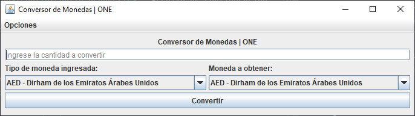
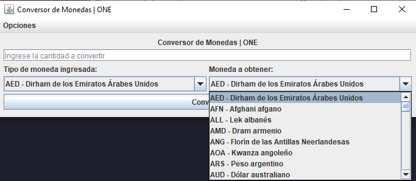
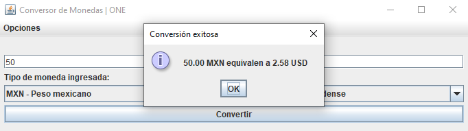
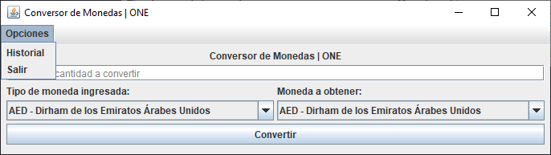
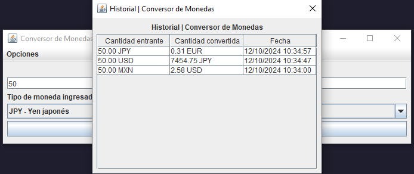

# Conversor de Monedas ONE

Este proyecto es una aplicación de escritorio en Java que permite convertir cantidades entre diferentes monedas utilizando tasas de conversión obtenidas de una API externa.

## Características

- **Validación de Entrada**: Asegura que la cantidad ingresada no sea negativa.
- **Manejo de Excepciones**: Utiliza excepciones personalizadas para manejar errores específicos de la conversión de moneda.
- **Interfaz Gráfica de Usuario (GUI)**: Implementada con `JFrame`, `JMenuBar`, `JMenu`, `JMenuItem`, `JDialog`, `JTable`, y `JScrollPane`.
- **Historial de Conversiones**: Muestra un historial de conversiones realizadas.
- **Uso de Librerías Externas**: Utiliza `Gson` para manejar JSON.
- **Manejo de Propiedades**: Configuraciones cargadas desde un archivo `config.properties`.
- **Llamadas a API**: Utiliza `HttpClient` para obtener tasas de conversión desde una API externa.

## Requisitos

- Java 11 o superior
- Maven
- API Key para [ExchangeRate-API](https://www.exchangerate-api.com/)

## Instalación

1. Clona el repositorio:
    ```sh
    git clone https://github.com/tu-usuario/conversor-monedas-one.git
    cd conversor-monedas-one
    ```

2. Configura el archivo `config.properties`:
    ```properties
    API_KEY=tu_api_key
    ```

## Uso

1. Ejecuta la aplicación.
2. Ingresa la cantidad y selecciona las monedas de origen y destino.
3. Haz clic en "Convertir" para obtener la cantidad convertida.
4. Puedes ver el historial de conversiones desde el menú "Opciones" -> "Historial".

## Estructura del Proyecto

- `src/com/one/conversormonedas/Main.java`: Punto de entrada de la aplicación.
- `src/com/one/conversormonedas/ConversionMoneda.java`: Lógica para obtener tasas de conversión.
- `src/com/one/conversormonedas/exceptions/ErrorConversionMonedaException.java`: Excepción personalizada para errores de conversión.
- `src/com/one/conversormonedas/modelos/ValoresMoneda.java`: Modelo para los valores de moneda.
- `src/com/one/conversormonedas/config/config.properties`: Archivo de configuración.

## Dependencias

- Se usa `Gson 2.11.0` jar.
- Se usa `MigLayout 3.7.4` jar.
- El archivo `TextPrompt` se extrajo de [Monkeyelgrande](https://youtu.be/PP-hBgaI8_A?si=sCxv_cs22t5NKpK3).

## Funcionamiento
Al ejecular la aplicación se muestra la siguiente interfaz:

La interfaz inicial consiste en una caja de texto, 2 listas desplegables (las cuales serán las encargadas de especificar las monedas de origen y a convertir, respectívamente) y el boton Convertir el cual convertirá la cantidad de la moneda origen a la moneda a convertir.


Al presionar el botón Convertir, se mostrará en la caja de texto la cantidad convertida.



También, se dispone de un menú ubicado en la parte superior de la ventana, el cuenta con las opciones Historial y Salir.



La opción Historial permite mostrar al usuario una tabla con todas las conversiones que ha realizado durante la ejecución del programa, junto con la fecha en la que se realizó.



La opción de Salir permite finalizar el programa.